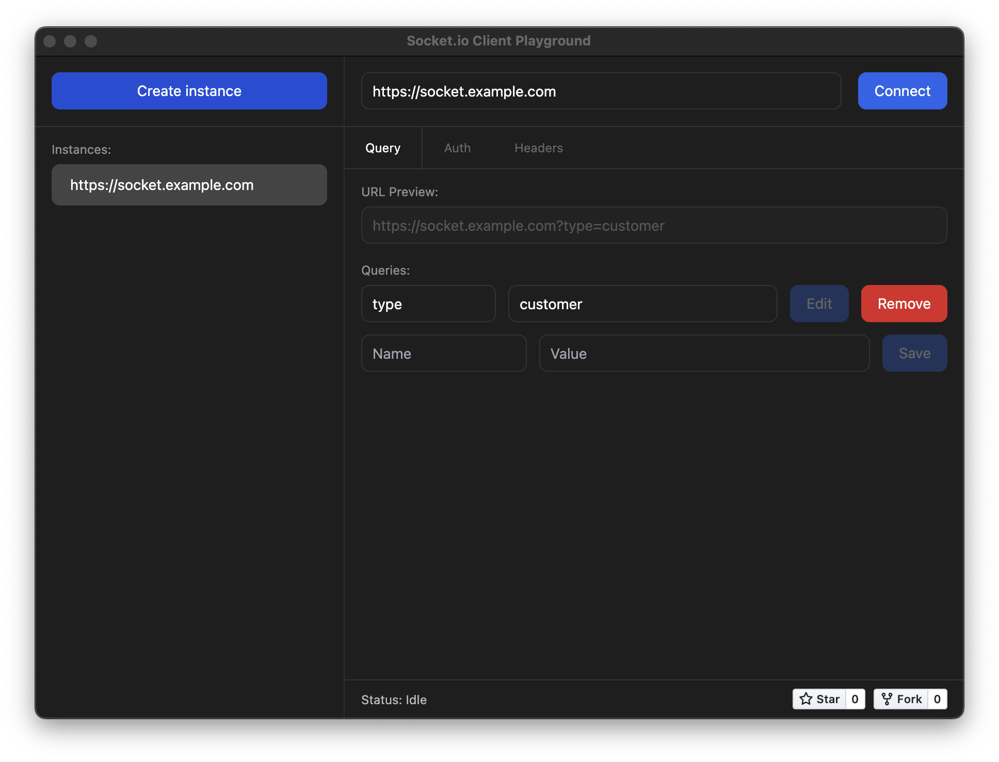

# Socket.io Playground (in development)

Open-source, cross-platform Socket.io GUI Developer Tool.

<p>
   <a href="https://github.com/aurotones/socket-io-playground/releases">
      
   </a>
</p>

<pre align="center">
   If you like my work, please consider <b><a href="#support-me">supporting me financially</a></b>
</pre>

### Features and planned features

- [x] Multiple socket instances
- [x] Customize queries, headers and authorization options
- [x] Log incoming socket events with supported data types
- [x] Emit socket event back to the server (string data only)
- [ ] Socket version selector
- [x] Raw socket option customization
- [x] Copy socket options
- [x] Play sound on incoming socket event
- [ ] Save instances and remember the options on the next launch

### Supported data types
- [x] Integer
- [x] String
- [x] Object
- [x] Array
- [ ] Buffer

## How to develop this project?
Development can be done on Mac, Windows, or Linux as long as you have Node.js installed.

1. Install the dependencies

```bash
$ npm install
```

2. Run in development mode

```bash
$ npm run dev
```

3. Run type checking

```bash
$ npm run typecheck
```

4. Build to executable

```bash
# For Windows to build
$ npm run build:win

# For macOS to build
$ npm run build:mac

# For Linux 
$ npm run build:linux
```
## Known issues
1. The Linux executable cannot be built on an ARM64 machine, so it is recommended to build it on an x86-64 machine,
   which will automatically handle the ARM64 architecture when specified.
2. The Windows executable may display an 'Unknown publisher' message, or the browser may show a false positive message,
   preventing users from downloading it. Solution for me is to purchase code signing certificate, but it costs me money.

## Support me
<ul>
   <li>
      <a href="https://buymeacoffee.com/aurotones" target="_blank">Buy me a coffee</a>
   </li>
   <li>
      BTC: <b>1ArME6NtSzmtu5pWPkTYMUV3ZMugrfZtPs</b>
   </li>
   <li>
      BTC: <b>1ArME6NtSzmtu5pWPkTYMUV3ZMugrfZtPs</b>
   </li>
   <li>
      BTC (BEP20): <b>0xf8a05118c66264630e0be3bc84c72443c81b2b34</b>
   </li>
   <li>
      BTC (ERC20): <b>0x6958a7f4550cf1b357e43fa5e772b05b618842d3</b>
   </li>
   <li>
      ETH (ERC20): <b>0x6958a7f4550cf1b357e43fa5e772b05b618842d3</b>
   </li>
   <li>
      ETH (BEP20): <b>0xf8a05118c66264630e0be3bc84c72443c81b2b34</b>
   </li>
   <li>
      USDT (TRC20): <b>TJ3q1fbTsqBmCbcWh5pUJuRXPBsVagvEzY</b>
   </li>
   <li>
      USDT (ERC20): <b>0x6958a7f4550cf1b357e43fa5e772b05b618842d3</b>
   </li>
   <li>
      ADA: <b>addr1v92nk36ynqv80fxjjsj88d407snfqz7m075dtfexcqxwadcdhnun4</b>
   </li>
</ul>
